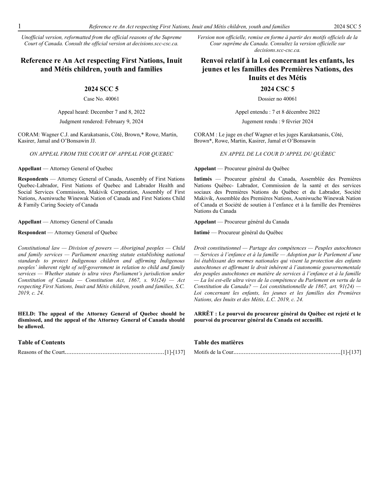
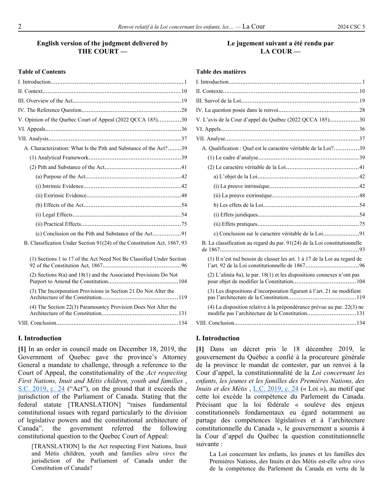
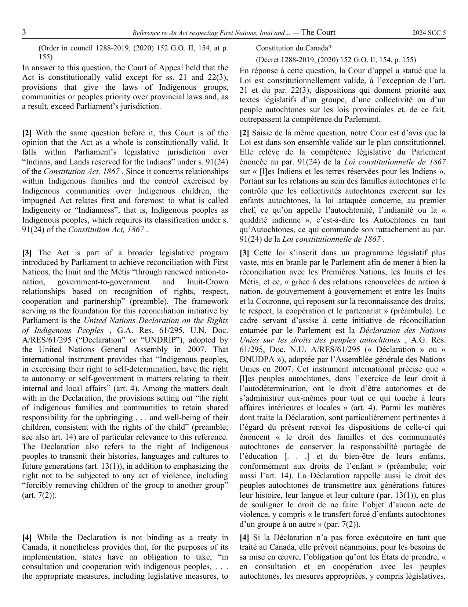
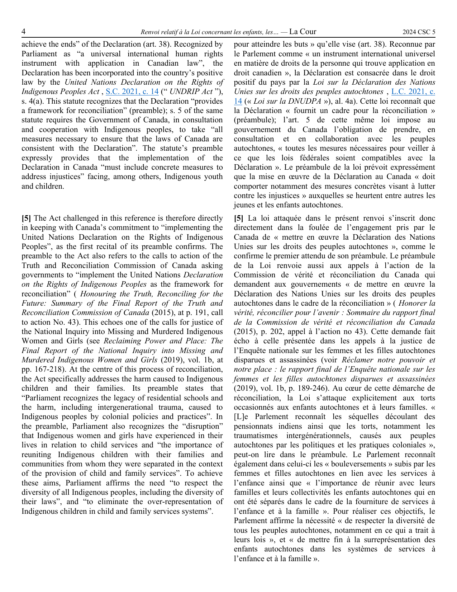
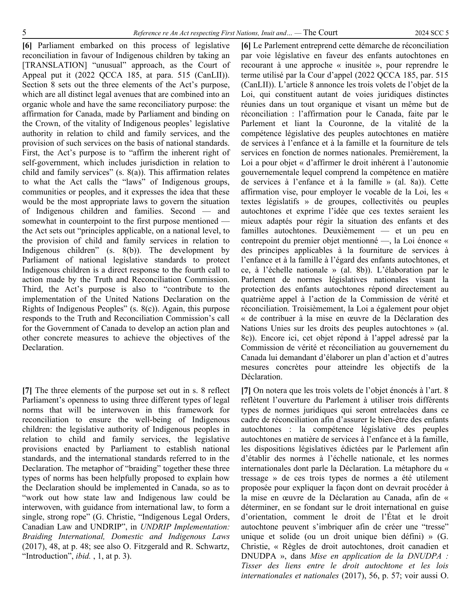
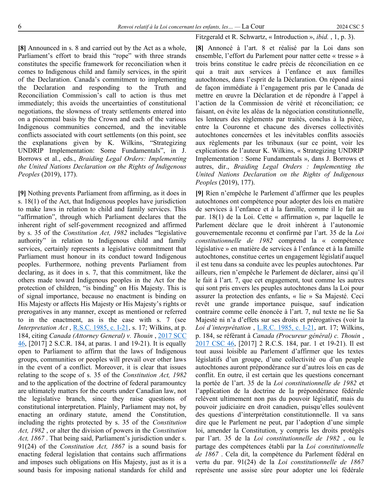
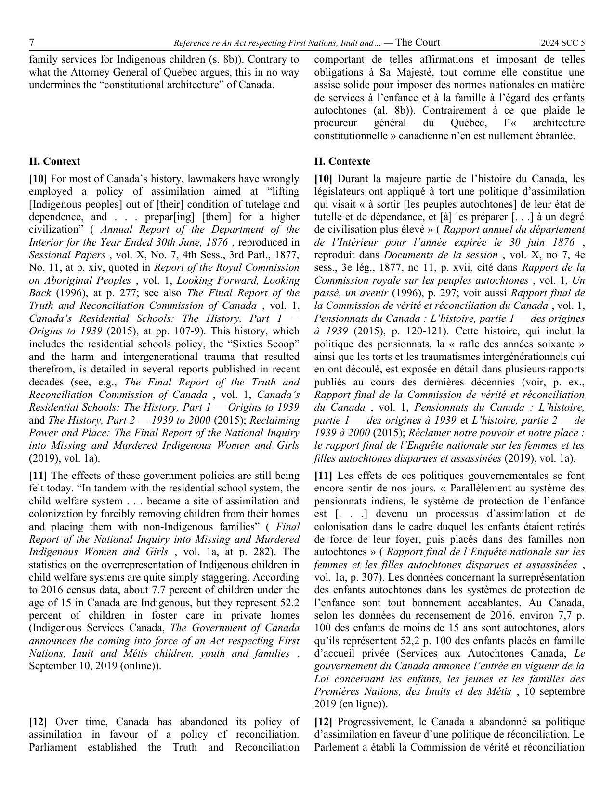
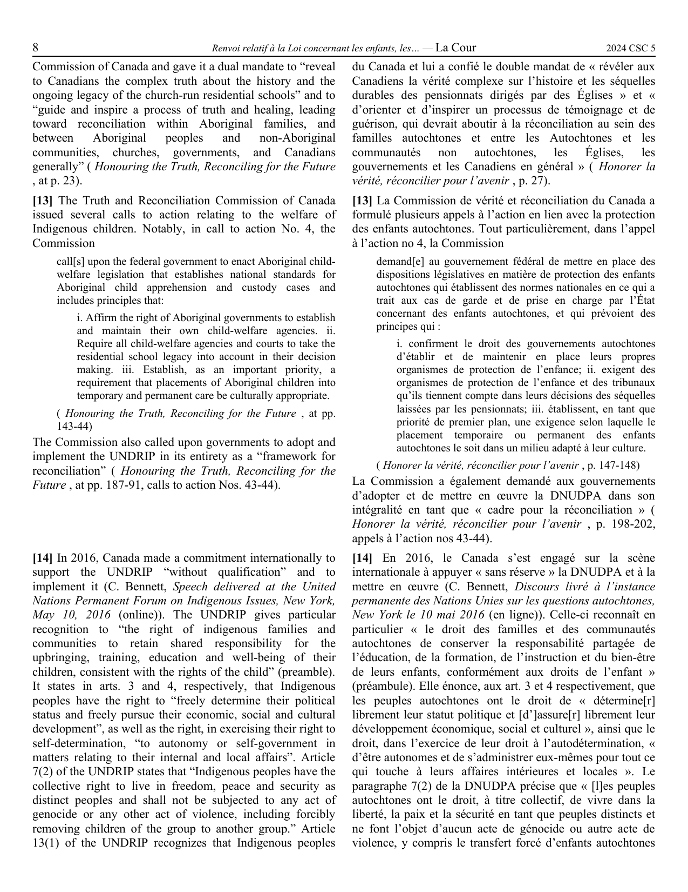
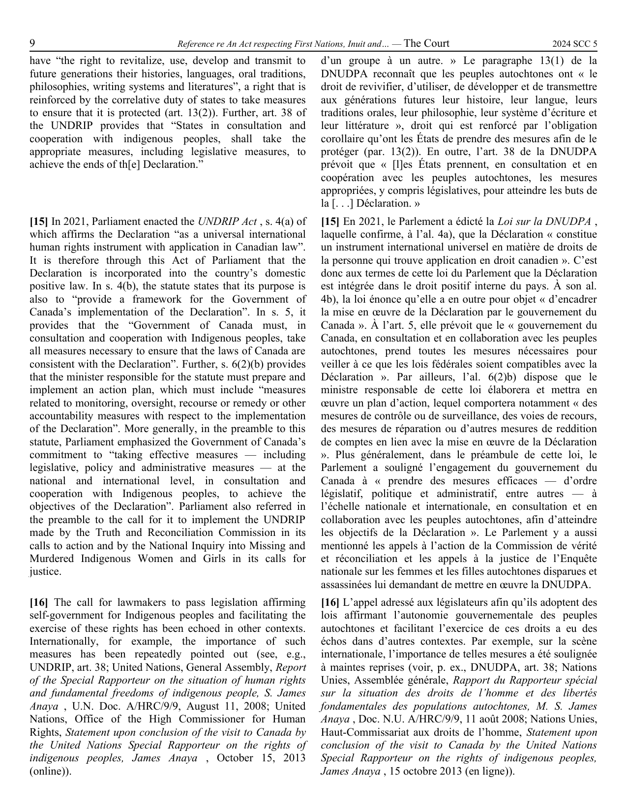
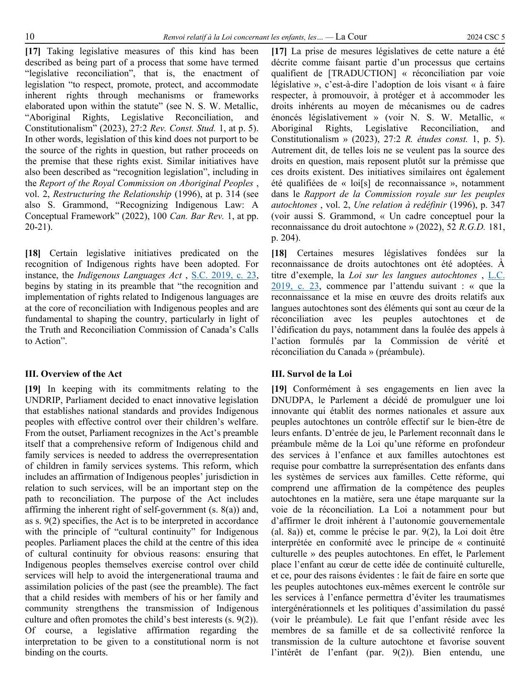

# SCC Bilingual Formatter

*Lire en [français](README.fr.md).*

A command-line tool that turns a **Supreme Court of Canada** decision into a
**side-by-side bilingual** Word document (`.docx`): English in the left column,
French in the right, paragraphs aligned by number.

From a single decision identifier, the tool downloads both official versions,
extracts their structure (judges, opinions, paragraphs, headings) and produces a
document ready to proofread or print.

## Features

- 📥 **Automatic download** of the English and French PDFs from `decisions.scc-csc.ca`
- 🧩 **Structured extraction**: title, neutral citation, hearing and judgment dates,
  the "on appeal from" mention and the headnote keywords; opinions (majority /
  concurring / dissenting) with their authoring judge and paragraph range; and the
  outline **headings** (`I.`, `A.`, `(1)`…, including unnumbered ones)
- ↔️ **Alignment** of paragraphs ¶N English ↔ ¶N French, with **bilingual heading
  reconciliation** — where one language detects a heading the other missed, it is
  recovered from the parallel version (exact parity on all test decisions)
- ↳ **Indented text** — block quotes, statutory extracts and enumerated lists are
  detected in the source PDF and reproduced indented and in a slightly smaller font
- 🔗 **Clickable CanLII links** on every neutral citation (`YYYY SCC N` / `YYYY CSC N`)
  in the body — the URL is built **deterministically from the citation**, with no network
  call (CanLII's citation rule), and surrounding italics/bold are preserved
- ⚖️ **Clickable Justice Canada links** on statute citations in the body, pointing to the
  **official** laws-lois.justice.gc.ca site — URLs built deterministically with no network
  call, covering two statute families:
  - **Revised statutes** (`R.S.C. 1985, c. C-50` / `L.R.C. 1985, c. C-50`): the cited
    chapter is the URL slug. (Supplements `c. 1 (5th Supp.)` have no deterministic
    per-chapter slug, so they are left unlinked — no dead links.)
  - **Annual statutes** (`S.C. 2010, c. 5` / `L.C. 2010, c. 5`): the slug is
    `{year}_{chapter}` (S.C. → `AnnualStatutes`, L.C. → `LoisAnnuelles`). Limited to
    years **≥ 2001**, where Justice Canada's coverage begins (earlier years 404, so they
    are left unlinked — no dead links).
- 📄 **Polished Word document**: bilingual cover page (unofficial-version notice, case
  name, citation, docket, dates, parties, coram, appeal mention, italic keywords,
  *Held / Arrêt* disposition, and a table of contents of the opinions); a per-opinion
  table of contents; a two-column body; a running header on **every page** (including
  the cover, where it shows the case name without a judge) that shows the page's
  authoring judge and **alternates English / French each page**; Times New Roman;
  justified text; inline italics and bold preserved

## Preview

<!-- Generated preview of SCC 20264 -->
<div id="scc-preview-gallery">
  <p><em>Sample output from a recent SCC decision (first 10 pages, French left / English right):</em></p>
  <div style="display: flex; flex-direction: column; gap: 2rem; max-width: 900px; margin: 2rem 0;">
    <figure>
      
      <figcaption style="text-align: center; font-size: 0.9em; color: #666; margin-top: 0.5rem;">Page 1</figcaption>
    </figure>
    <figure>
      
      <figcaption style="text-align: center; font-size: 0.9em; color: #666; margin-top: 0.5rem;">Page 2</figcaption>
    </figure>
    <figure>
      
      <figcaption style="text-align: center; font-size: 0.9em; color: #666; margin-top: 0.5rem;">Page 3</figcaption>
    </figure>
    <figure>
      
      <figcaption style="text-align: center; font-size: 0.9em; color: #666; margin-top: 0.5rem;">Page 4</figcaption>
    </figure>
    <figure>
      
      <figcaption style="text-align: center; font-size: 0.9em; color: #666; margin-top: 0.5rem;">Page 5</figcaption>
    </figure>
    <figure>
      
      <figcaption style="text-align: center; font-size: 0.9em; color: #666; margin-top: 0.5rem;">Page 6</figcaption>
    </figure>
    <figure>
      
      <figcaption style="text-align: center; font-size: 0.9em; color: #666; margin-top: 0.5rem;">Page 7</figcaption>
    </figure>
    <figure>
      
      <figcaption style="text-align: center; font-size: 0.9em; color: #666; margin-top: 0.5rem;">Page 8</figcaption>
    </figure>
    <figure>
      
      <figcaption style="text-align: center; font-size: 0.9em; color: #666; margin-top: 0.5rem;">Page 9</figcaption>
    </figure>
    <figure>
      
      <figcaption style="text-align: center; font-size: 0.9em; color: #666; margin-top: 0.5rem;">Page 10</figcaption>
    </figure>
  </div>
</div>

## Installation

```bash
git clone https://github.com/elieparise76/scc-bilingual.git
cd scc-bilingual
python -m venv .venv && source .venv/bin/activate
pip install -r requirements.txt
```

## Usage

Pass either the **neutral citation** or the **Lexum item ID**:

```bash
python main.py "2024 SCC 5"
# → scc_20264_bilingue.docx   (English | French)

python main.py 20264           # equivalent — item ID from the decision URL

# Options
python main.py "2024 SCC 5" --lang-order fr               # French on the left (default: en)
python main.py "2024 SCC 5" --output path/to/output.docx
python main.py 20264 --pdf-en en.pdf --pdf-fr fr.pdf      # provide the PDFs locally
```

Both `SCC` (English) and `CSC` (French) citation forms are accepted and resolve to
the same document. The item ID is the number in the decision URL on
`decisions.scc-csc.ca/.../item/<ID>/index.do`.

> **Word tip**: the header uses dynamic fields (page number, current judge). They are
> generated with a cached value so they display on open; if they ever show blank,
> select all (`Cmd/Ctrl+A`) then press `F9`, or open print preview, to refresh them.

## How it works

A five-stage pipeline, each stage a module with one clear deliverable function:

```
Lexum item ID ("20264")
  → fetch_pdfs(item_id) -> (pdf_en, pdf_fr)              # fetcher.py
  → parse_pdf(pdf_bytes) -> Decision                     # parser.py  (×2)
  → align(decision_fr, decision_en) -> [AlignedSection]  # aligner.py
  → render_docx(sections, metadata, output) -> .docx     # renderer.py
                                                          # main.py orchestrates
```

SCC decisions follow a stable template, exploited closely: the cover and opinion
columns are separated by word coordinates (not `extract_text`, which interleaves
them); the opinion block under `CORAM` is the source of truth for sections; headings
are detected by structure (position just before a paragraph marker) rather than
typography; indented blocks are detected by their horizontal offset from the body
margin. See [`CLAUDE.md`](CLAUDE.md) for the implementation details.

## Stack

Python 3 · [httpx](https://www.python-httpx.org/) · [pdfplumber](https://github.com/jsvine/pdfplumber) · [python-docx](https://python-docx.readthedocs.io/)

## Status and next steps

The full pipeline is functional, including neutral citation resolution.

Test decisions in [`samples/`](samples/): `20264` (unanimous, "The Court"),
`20701` (split, majority + dissent) and `20546` (long, with unnumbered English
headings and a printed table of contents — the heading-detection stress case).

## License

To be determined. Supreme Court of Canada decisions may be reproduced free of charge
(Reproduction of Federal Law Order).
